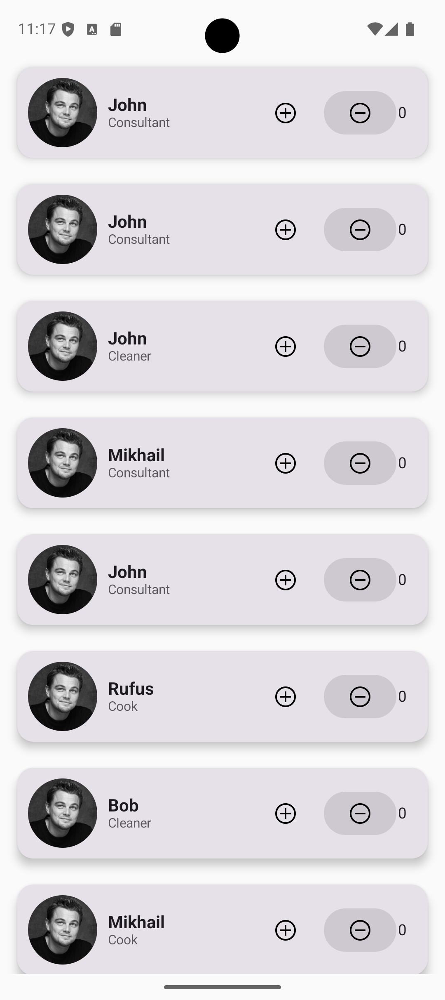

# 📱 Learning Application (Kotlin + Jetpack Compose)

> 🧠 Обучающий проект для освоения фундаментальных концепций Android-разработки с использованием **modern UI toolkit — Jetpack Compose**.  
> Цель — построить понимание декларативного подхода, управления состоянием и компоновки интерфейса «с нуля».

---

## 🔍 Что уже изучено и реализовано

### 🧱 Основы компоновки (Layout)
- ✅ **`Row` / `Column`** — вертикальное и горизонтальное расположение элементов
- ✅ **`Box`** — наложение и произвольное позиционирование
- ✅ **`Spacer`**, `weight`, `fillMaxWidth/Height`, `wrapContentSize`
- ✅ **`Arrangement.SpaceBetween` / `SpaceEvenly` / `spacedBy()`** — контроль расстояний между элементами
- ✅ **`Modifier`** — ключевой инструмент для размеров, отступов, кликабельности, скруглений и т.д.

### 🎨 Компоненты UI
- ✅ **Card** — карточки с elevation и закруглёнными углами
- ✅ **Image** — загрузка из `drawable`, `contentScale`, `clip` (включая `CircleShape`)
- ✅ **Text** — стилизация (размер, вес, цвет)
- ✅ **Icon** — векторные и растровые иконки внутри `Button` и `IconButton`
- ✅ **Button (Material 3)** — кастомизация цветов, состояний, размеров, отключение через `enabled`
- ✅ **LazyColumn** — эффективная вертикальная прокрутка для списка карточек/элементов (реализовано)

### 🧠 Управление состоянием
- ✅ **`remember { mutableStateOf(...) }`** — локальное состояние (имя, профессия)
- ✅ **`remember { mutableIntStateOf(...) }`** — оптимизированный `Int`-state для счётчика
- ✅ **Recomposition** — автоматическое обновление UI при изменении state
- ✅ Условная активность (`enabled = counter > 0`) — реакция на состояние

### 🖼️ Продвинутые техники (частично)
- ✅ **`clickable` на `Card`** — имитация поведения кнопки без `Button`
- ✅ **`statusBarsPadding()` / `systemBarsPadding()`** — адаптация под нотч и системные панели
- ✅ **Динамическая генерация данных** — `getRandomName()`, `getRandomProf()`
- ✅ Работа с **ресурсами** — `R.drawable.xxx`, `painterResource()`

---

## 📸 Скриншоты

| Интерфейс                                      | Поведение                                                                            |
|------------------------------------------------|--------------------------------------------------------------------------------------|
|  | Карточки с аватаром, именем, профессией, двумя кнопками управления (`+`/`–`) и счётчиком |

---

## 💻 Как запустить (Quickstart)

Требования:
- Android Studio Giraffe / Hedgehog (или новее)
- JDK 17+
- Минимальная поддерживаемая версия Android: API 24 (Android 7.0) — проверяйте в `app/build.gradle.kts`

Шаги:
1. Клонируйте репозиторий:
   git clone https://github.com/mrRazmarin/learning-application-kotlin.git
2. Откройте проект в Android Studio.
3. Дождитесь синхронизации Gradle (Gradle sync).
4. Запустите на эмуляторе или физическом устройстве с API >= 24.

Команды (в корне проекта):
- Сборка debug-версии:
  ./gradlew assembleDebug
- Установка на подключённое устройство:
  ./gradlew installDebug

---

## 🗂 Структура проекта (общая)
- app/ — модуль приложения (UI, resources, манифест)
- src/main/java|kotlin/... — пакеты с реализацией Compose UI и логикой
- res/drawable/ — изображения и иконки
- img/ — скриншоты для README

---

## 🔎 Планы на будущее
- [ ] `ViewModel` + `StateHoisting` — вынос логики из UI
- [ ] Темизация (`MaterialTheme`, `colorScheme`)
- [ ] Анимации (`animate*AsState`, `Transition`)
- [ ] Навигация (`Navigation Compose`)
- [ ] Тестирование (`ComposeTestRule`)

---

## 🛠 Технические детали
- **Язык:** Kotlin
- **UI Toolkit:** Jetpack Compose (Material 3)
- **Min SDK:** 24 (Android 7.0)
- **IDE:** Android Studio Giraffe / Hedgehog
- **Gradle:** Kotlin DSL, Compose BOM

---